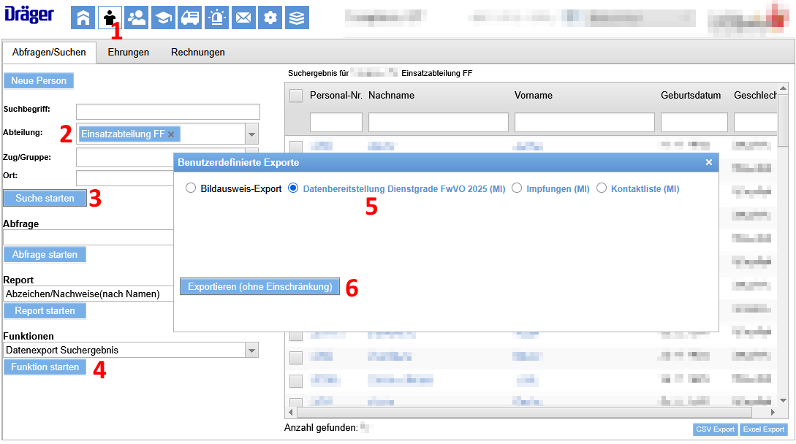
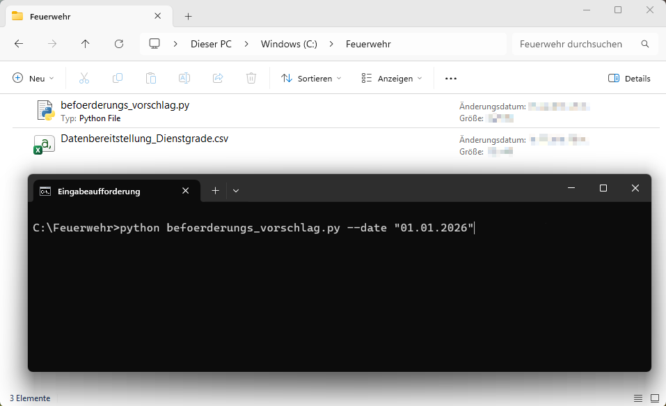

# Beförderungsvorschlag 
Prüfung der Beförderungsvorschläge aus einem Datenexport von FeuerON gemäß den Angaben 
der Niedersächsischen Feuerwehrverordnung.

Derzeit werden die "neuen" Voraussetzungen geprüft, aber die "alten" Dienstgrade verwendet --> [ToDos](#todos). 

# ToDos

Aktuell werden nur die Mindestdienstzeit und die Lehrgangsvorrausetzungen geprüft.

Die Vorraussetzungen, welche sich aus der Dienststellung / Funktion ergeben und welche Dienststellungen 
in welcher Anzahl (für die jeweilige Art der Feuerwehr) vorgehalten werden müssen sind noch nicht implementiert. 

- Umstellen auf neue Dienstgrade (siehe `class Dienstgrad`) 

# Benutzung

## 1. Datenexport aus FeuerON
- Im Reiter "*Personen*" alle Mitglieder der Einsatzabteilung über die Suche aufrufen (Schritte 1-3).
- Die Funktion "*Datenexport Suchergebnis*" ausführen, um die aktuelle 
  Auflistung als csv Datei zu speichern (Schritte 4-6).
  

Eine Musterdatei mit dem aktuellen Exportformat ist im Verzeichnis [doc/Muster_Datenbereitstellung_Dienstgrade.csv](doc/Muster_Datenbereitstellung_Dienstgrade.csv) zu finden.

## 2. Aufruf von befoerderungs_vorschlag.py
Das Sript via Kommandozeile[^1] mit den benötigten Parametern aufrufen:

| Parameter             | default-Wert     | Bedeutung               |
|:----------------------|:----------------:|:------------------------|
| `-i`   `--input`   | "./Datenbereitstellung_Dienstgrade.csv" | Dateipfad für die FeuerOn Daten.|
| `-o`   `--output`  | "./Output.csv"   | Dateipfad für die Ausgabedaten.|
| `-d`   `--date`    | *>>heute<<*      | Datum, zu dem die Bedingungen geprüft werden sollen. (Angabe in "tt.mm.yyyy")|
| `--trace`             | "warning"        | Tracelevel für Fehlermeldungen. ["warning", "info", "debug"]|
| `-h`   `--help`    |                  | Hilfe anzeigen.|

Für den Fall, dass der Datenexport im Verzeichnis *C:/Feuerwehr* liegt 
und die Ausgabedatei mit einer Prüfung zum 01.01.2026 im selben Ordner erstellt werden soll, 
wird das Skript über folgende Parameter 
aufgerufen:
`python befoerderungs_vorschlag.py -i "C:/Feuerwehr/Datenexport.csv" -o "C:/Feuerwehr/Beförderungen_2026.csv" -d "01.01.2026"`
Die Vorraussetzungen werden in der Datei *Beförderungen_2026.csv* im Verzeichnis *C:/Feuerwehr* gespeichert.

## 2.1 Aufruf per python-Interpreter

Wird als Eingangsdatei der Standardwert *Datenbereitstellung_Dienstgrade.csv* verwendet, muss der Parameter nicht extra übergeben werden.
Gleiches gilt für die Ausgabedatei.

*requirements.txt* für benötigte Pakete beachten.

## 2.2 Aufruf per uv

Alternativ kann der der Python Manager [uv](https://docs.astral.sh/uv/ "uv Python Manager") genutzt werden, wenn das Projekt inklusive *pyproject.toml* ausgecheckt wurde.
Alle Abhängigkeiten werden dann in einem virtual environment installiert.

## 2.3 Kommandozeile öffnen
[^1]: Öffnen eine Eingabeaufforderung oder PowerShell im Verzeichnis `C:/Feuerwehr` durch`Shift+Rechtsklick` auf den Ordner `Feuerwehr`.